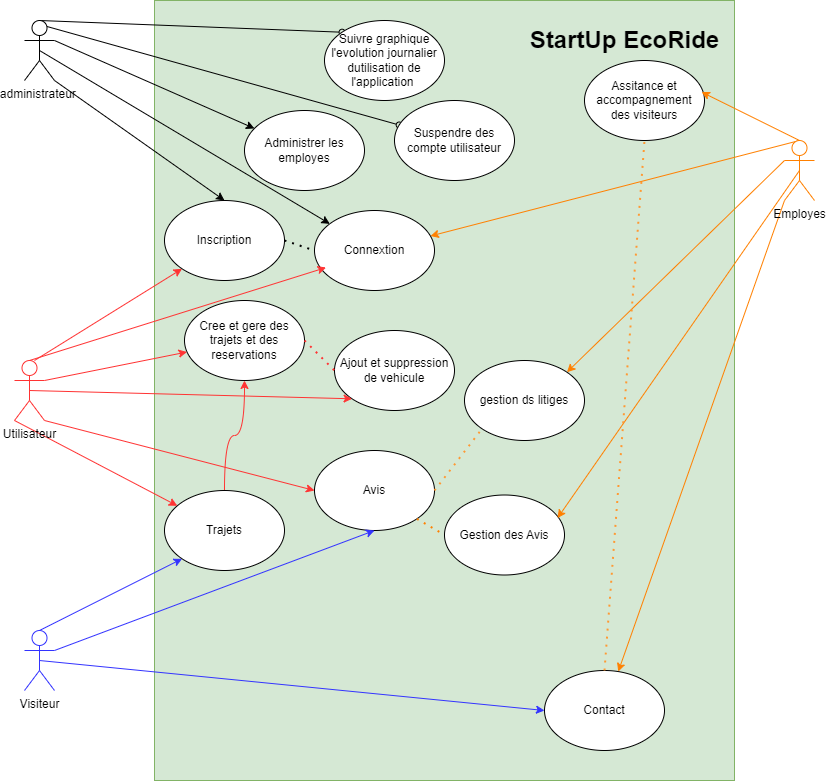

# 🚗 **StartUp EcoRide**

EcoRide est une plateforme de covoiturage en ligne et écologique, conçue pour permettre aux voyageurs de partager leurs trajets tout en réduisant l’impact environnemental des déplacements. Cette application vise à promouvoir une mobilité plus durable et accessible à tous.

---

## 📋 **Objectif du Projet**

L'objectif principal d'EcoRide est de devenir une solution phare pour les covoitureurs en automobile, en offrant :
- Une expérience utilisateur fluide.
- Des paiements intégrés.
- Un accompagnement complet des utilisateurs avec des fonctionnalités avancées.

---

## Diagramme de Classes

Le diagramme ci-dessous représente les entités principales et leurs relations dans le projet EcoRide.




## Maquette Figma
Ce projet est basé sur la maquette Figma suivante :
[Lien vers la maquette](https://www.figma.com/design/uX3aCztfAknpFMed9e4N1m/StartUp-Ecoride)


## 🔧 **Technologies Utilisées**

### **Front-end :**
- **HTML5** : Structure de l'application.
- **CSS3/SCSS** : Mise en forme et design.
- **JavaScript ES6** : Logique et interactivité côté client.
- **Chart.js** : Visualisation des données dans l'espace administrateur.

### **Back-end :**
- **Symfony 6.4** : API utilisée pour la gestion des données.

### **Outils recommandés :**
- **Node.js** : Gestion des dépendances avec npm.
- **VS Code** avec extensions :
  - PHP Server.
  - Live Sass Compiler.
  - JS Codeformer.
- **phpSTORM**.

---

## Installation
Front-end :
1. Clonez le dépôt depuis le repository :
   ```bash
   git clone git@github.com:willems57/StartUp_Eco-Ride.git
   ```
2. Installez les dépendances Node.js avec npm :
   ```bash
   npm install
   ```
3. Compilez les fichiers SCSS en CSS (si nécessaire).

Back-end :
1. Créez les fichiers .env.local pour configurer vos

2. Configurez DATABASE_URL dans ces fichiers.

3. Exécutez les commandes suivantes pour préparer l'environnement :
composer install
php bin/console doctrine:database:create
php bin/console doctrine:migrations:migrate

---

## Lancez un serveur local :
- Front-end : Utilisez un outil comme Live Server.
- Back-end : Lancez le serveur Symfony.

## Importer les donner sql : 
- importer les le fichier stratup.sql dans la base de donne une fois celle-ci cree.

---

## Fonctionnalités Principales
- Utilisateurs :
Gestion des trajets : Ajout, modification, suppression et réservation.
Paiements intégrés : Gestion des crédits pour effectuer des paiements.

- Véhicules : 
Enregistrement et modification des informations sur les véhicules.

- Commentaires et notes : 
Possibilité de laisser des avis sur les trajets.

-  Administrateurs :
 Gestion des utilisateurs : Employés, suspension, réactivation et suivi des comptes.
Statistiques : Visualisation des courbes d'utilisation quotidienne via des graphiques interactifs.

- Employés :
Support client : Gestion des messages et contacts des utilisateurs.
Modération : Gestion et validation des avis.

---

## Structure du projet

### Fichiers principaux :
- **index.html** : Page principale contenant la barre de navigation et depuis laquel je peut naviguer sur l'emssemble de mon projet.

### Dossiers :
- **scss/** : Fichiers SCSS pour le style (compilés en CSS).
  - main.scss
  - main.css
  - main.css.map

- **router/** : Gestion des routes et de l'arborescence des pages.
  - allRoute.js : Lien entre les pages HTML et JavaScript.
  - router.js
  - route.js

- **pages/** :
  - 404.html
  - accueil.html
  - avis.html
  - contact.html
  - utilisateurs/
    - utilisateur.html
    - utilisateur.js
  - employes/
    - employes.html
    - employes.js
  - covoiturage/
    - trajets.html
    - trajets.js

- **js/** : Scripts JavaScript principaux.
  - avis.js
  - contact.js
  - script.js
  - auth/
    - accueil.js
    - signin.js
    - signup.js

- **images/** : Contient les images utilisées sur le site.

- **auth/** :
  - signin.html
  - signup.html

- **admin/** : Pages et scripts pour l'administration.
  - abonnees.html
  - abonnees.js
  - administrateur.html
  - administrateur.js
  - signup2.html
  - signup2.js
  - suspendu.html
  - suspendu.js

---

## Configuration de l'API
Assurez-vous que l'API Symfony est opérationnelle.

- Accès administrateur :
Email : Jose@ecoride.com
Mot de passe : Ecoride@2025

- Accès utilisateur :
Email : user1@example.com
Mot de passe : password@123

## Visualisation des Statistiques (Graphiques)
L'espace administrateur utilise Chart.js pour afficher des graphiques interactifs :

- Covoiturages par jour : Ligne.
- Revenus par jour : Histogramme.

## Test de déploiement
Pour déployer le projet :

Configurez un service de déploiement comme Heroku, Netlify, ou Vercel.
Vérifiez la présence des fichiers nécessaires :
package.json pour les dépendances front-end.
Procfile (si Heroku est utilisé).