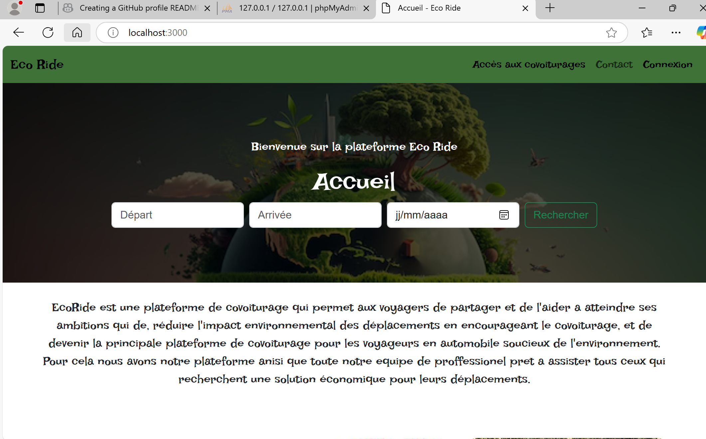
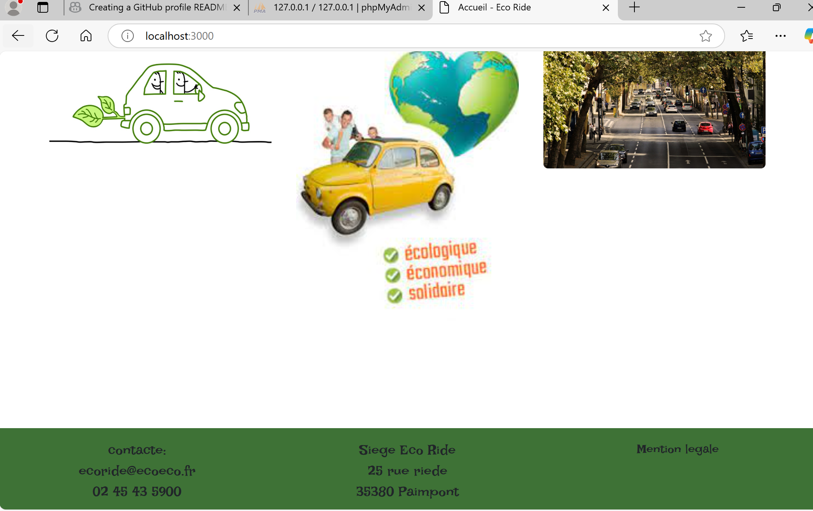
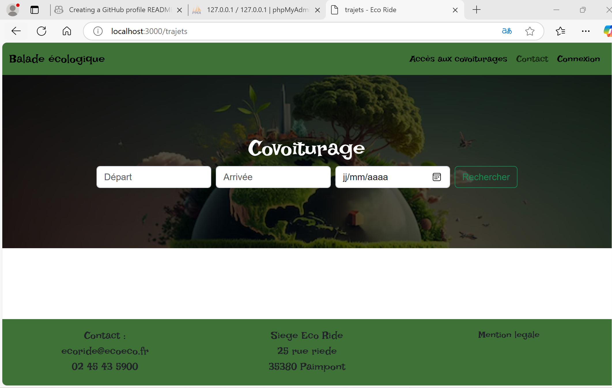

# StartUp EcoRide

EcoRide est une plateforme de covoiturage en ligne et écologique, visant à réduire l'impact environnemental des déplacements tout en offrant une solution économique et pratique pour les utilisateurs. L'application propose une gestion efficace des trajets, des réservations, et des paiements intégrés.

---

[](https://github.com/willems57)

## Table des matières

- [Technologies utilisées](#technologies-utilisées)
- [Installation](#installation)
- [Fonctionnalités principales](#fonctionnalités-principales)
- [Structure du projet](#structure-du-projet)
- [Utilisation](#utilisation)
- [Configuration API](#configuration-api)
- [Captures d'écran](#captures-d'écran)

---

## Technologies utilisées

Le projet front-end a été développé avec les technologies suivantes :
- **HTML**
- **CSS/SCSS**
- **JavaScript**

---

## Installation

1. Clonez le dépôt depuis le repository :
   ```bash
   git clone git@github.com:willems57/StartUp_Eco-Ride.git
   ```
2. Installez les dépendances Node.js avec npm :
   ```bash
   npm install
   ```
3. Compilez les fichiers SCSS en CSS (si nécessaire).

---

## Fonctionnalités principales

### Pour les utilisateurs :
- **Gestion des trajets** : Création, réservation et affichage des trajets.
- **Gestion des véhicules** : Ajout et suppression des véhicules utilisés.
- **Paiements intégrés** : Paiement des trajets en utilisant un système de crédits.

### Pour l'administrateur :
- **Gestion des employés** : Ajout et suspension des comptes utilisateurs.
- **Observation des statistiques** : Courbes journalières des taux d'utilisation du site.

### Pour les employés :
- **Gestion des avis et messages** : Réponse et suivi des contacts utilisateurs.
- **Support aux utilisateurs** : Assistance aux demandes des clients.

---

## Structure du projet

### Fichiers principaux :
- **index.html** : Page principale contenant la barre de navigation et depuis laquel je peut naviguer sur l'emssemble de mon projet.

### Dossiers :
- **scss/** : Fichiers SCSS pour le style (compilés en CSS).
  - main.scss
  - main.css
  - main.css.map

- **router/** : Gestion des routes et de l'arborescence des pages.
  - allRoute.js : Lien entre les pages HTML et JavaScript.
  - router.js
  - route.js

- **pages/** :
  - 404.html
  - accueil.html
  - avis.html
  - contact.html
  - utilisateurs/
    - utilisateur.html
    - utilisateur.js
  - employes/
    - employes.html
    - employes.js
  - covoiturage/
    - trajets.html
    - trajets.js

- **js/** : Scripts JavaScript principaux.
  - avis.js
  - contact.js
  - script.js
  - auth/
    - accueil.js
    - signin.js
    - signup.js

- **images/** : Contient les images utilisées sur le site.

- **auth/** :
  - signin.html
  - signup.html

- **admin/** : Pages et scripts pour l'administration.
  - abonnees.html
  - abonnees.js
  - administrateur.html
  - administrateur.js
  - signup2.html
  - signup2.js
  - suspendu.html
  - suspendu.js

---

## Utilisation

### Extensions recommandées pour VS Code :
- **PHP Server**
- **Live Sass Compiler**
- **Icon Viewer**
- **JS Codeformer : JavaScript Refactoring & Code Automation**

---

## Configuration API

L'application communique avec une API. Pour tester l'application :
- Inscrivez-vous via la page d'inscription.
- Connectez-vous avec les informations suivantes pour un accès administrateur :
  - **Email** : `Jose@ecoride.com`
  - **Mot de passe** : `Ecoride@2025`
- Connectez-vous avec les informations suivantes pour un accès utilisateur :
  - **Email** : `user1@example.com`
  - **Mot de passe** : `password@123`

---

## Captures d'écran





---

